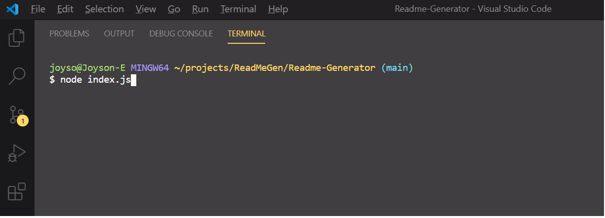

# ReadmeGenerator    

  
I've created an easy to use **ReadMe Generator**, using Node.  Following the simple guides, you'd be able to develop professional ReadMe. 

 
## Usage

  
Usage Video can be accessed at [ReadMe Tutorial](https://spark.adobe.com/video/xjObNpvfCGpoT)

  

## Repository

  

All web app `code` is available at repository [GitHub Repo](https://github.com/enochj316/Readme-Generator)

  

## License

  
This source code is available to everyone under the standard 
